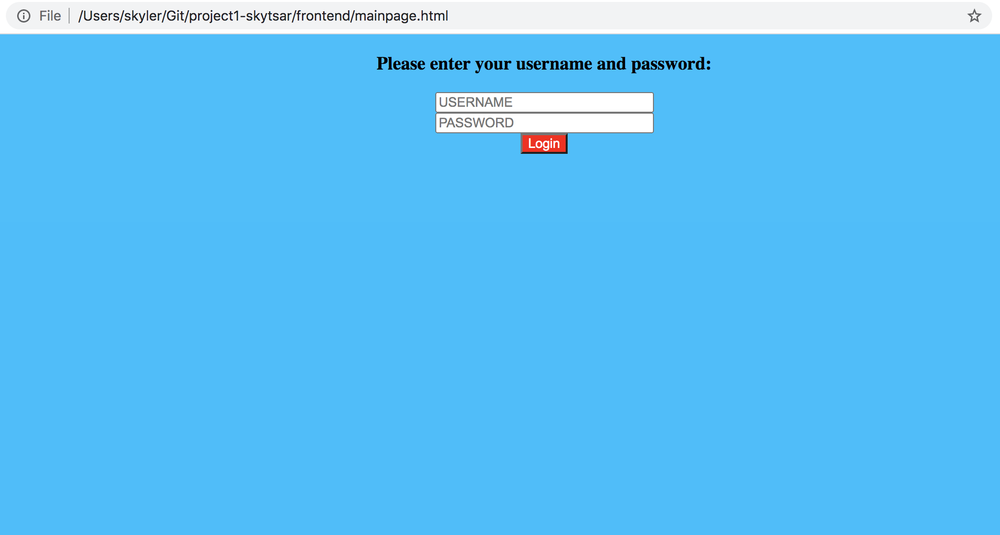

# Employee Reimbursment System (ERS)

## Executive Summary
The Expense Reimbursement System (ERS) will manage the process of reimbursing employees for expenses incurred while on company time. All employees in the company can login and submit requests for reimbursement and view their past tickets and pending requests. Finance managers can log in and view all reimbursement requests and past history for all employees in the company. Finance managers are authorized to approve and deny requests for expense reimbursement.

**State-chart Diagram (Reimbursement Statuses)** 

**Reimbursement Types**

Employees must select the type of reimbursement as: LODGING, TRAVEL, FOOD, or OTHER.

**Logical Model**

**Physical Model**

**Use Case Diagram**

**Activity Diagram**

## Technical Requirements

The back-end system shall use JDBC to connect to a Postgres database. The application shall deploy onto a Tomcat Server. The middle tier shall use Servlet technology for dynamic Web application development. The front-end view shall use HTML/CSS/JavaScript to make an application that can call server-side components in a generally RESTful manner. Passwords shall be encrypted in Java and securely stored in the database. The middle tier shall follow proper layered architecture, have reasonable (~70%) test coverage of the service layer, and implement log4j for appropriate logging. Webpages shall be styled to be functional and readable. 

## Technologies used**
 * JDBC
 * Postgres
 * Tomcat
 * Java
 * CSS
 * Html

## Getting started
 * Clone from the Github repository
 * Configure Postgress Sql settings
 * Run the project on a Tomcat 9 server
 * Open **mainpage.html** on your browser

## Features
* login
* View All requests (if Finance manager employee)
* View personal requests (if regular employee)
* Filter requests based on status
* Add an ERS request
* (If user is logged in as a Finance Manager) Deny or accept requests

## Usage
Input a valid username and password. Once you log it you will see two buttons that say "Submit new Request" and "Observe Requests" as well as a seemingly blank dropdown box. The dropdown box is used for the filter. Select the status you wish to see, then click the "Observe requests" button to see a filtered list. If you wish to change the status of a request, input the request ID number you of the desired request, use the dropdown box to select the desired status, then click the "Process request" button.
If you wish to submit a new request, click on the "Submit new Request" button, entere the prompted information then click on the "submit" button. Your request should show up in the table once you click the "observe requests" button again.

